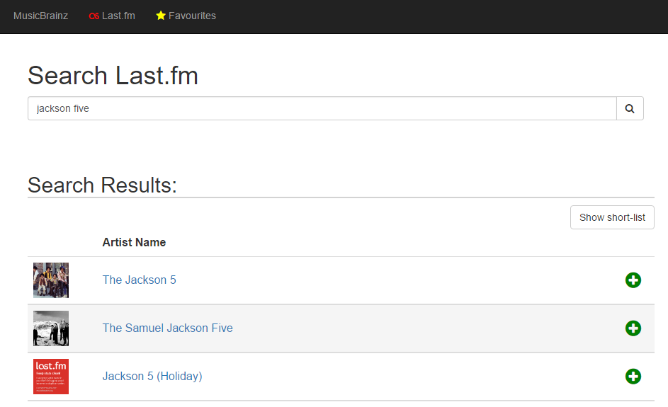
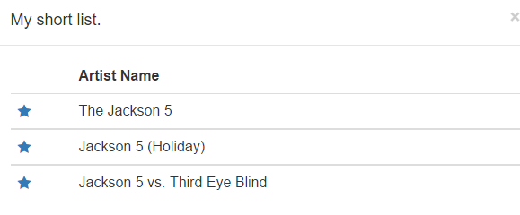
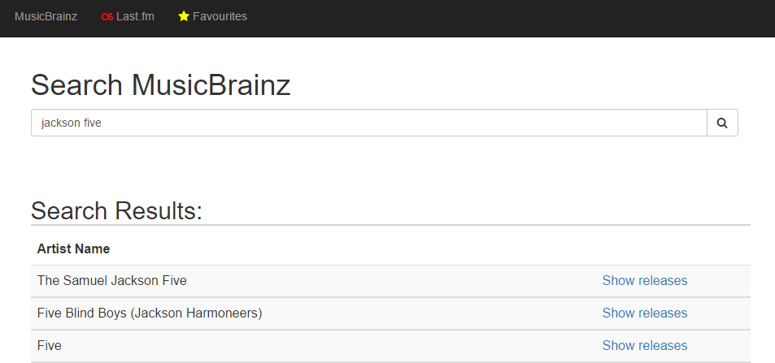
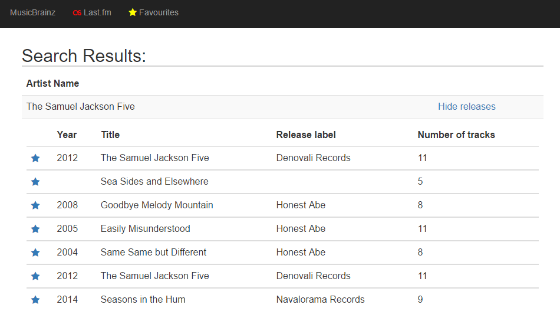
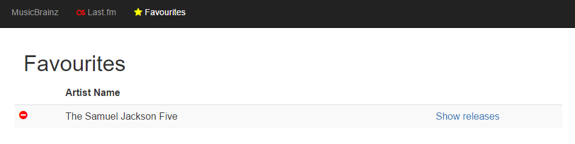

# Technical assessment for frontend developer

## The purpose of the assessment is to test your ability:
* build a front end using HTML and CSS using responsive design
* use JavaScript efficiently
* integration with external APIs using JavaScript

## Please use the following tools as part of your solution:
* HTML(5)
* CSS(3) and/or Bootstrap
* JavaScript, jQuery, EmberJS, AngularJS, Knockout

## What is expected?
The assessment requires you to build a front end to allow an end user to search for their favourite artist using the last.fm API and add the artist to a list of favourite artists. Further to this, the front should allow the user to find the releases for a specific artist, and add releases to their favourites. Finally the front end should allow the user to see their favourites and update their favourites.

***Junior developer role***
Do not implement the favouriting functionality nor implement the releases functionality mentioned.

### Artist search
When the user selects the last.fm link from the navigation bar, the front end will allow the user to search for their favourite artist. The information is retrieve via AJAX from the last.fm API. The search result from the last.fm API is then displayed in the search results list. From this list the user is able to add an artist to a short list. Once in the short list an arist can be added to the user's favourites.

### Releases for an artist
When the user selects the MusicBrainz link from the navigation bar, the front end will allow the user to search for an artist using the MusicBrainz API. The search results of the search is shown in the search results list. From the search result list, the user can select to see all releases by the artist by clicking on the "show releases" link. When clicking the link, the releases for the corresponding artist will be retrieved from the MusicBrainz API and displayed in the releases list. The following release information is show:

*	Year of release
*	Title of release
*	The label releasing the release
*	Number of tracks on the release
*	Ability to add the release to the user's favourites.

### User favourites
When the user selects the Favourites link from the navigation bar, the front end will show the user's favourite artists and release in two different lists. The user should have the ability to remove artists and release from their favourites. The user's favourite can either be stored in local browser storage, cookies or a session variable. The information **does not need to be persisted to a backend system**.

## Supporting documentation
* The MusicBrainz API is well documented and the information can be found at http://musicbrainz.org/doc/Development/XML_Web_Service/Version_2/Search
* Documentation regarding the last.fm API can be found at http://www.last.fm/api

## What should be part of your solution?
* The solution should be delivered as a collection (or single) of HTML pages / application with all the required CSS and JavaScript files.
* Any other documentation needed to execute your solution

## How will the technical assessment be evaluated?
* The code will evaluated for clarity, design and readability.
* If any tests are part of the submitted solution, the tests will be run the test the solution. The tests will be evaluated to verify the quality of the tests.
* The solution will be opened in the Chrome browser and the functionality described above will be tests. Both positive and negative tests will be done against the solution.
* Responsive layouts will be simulated using Chrome's developer tools.

## How do I submit my solution?
Send a pull request from your repository.

## Questions or comments
Please use the issues functionality on Github. All questions will be answered via Github.
